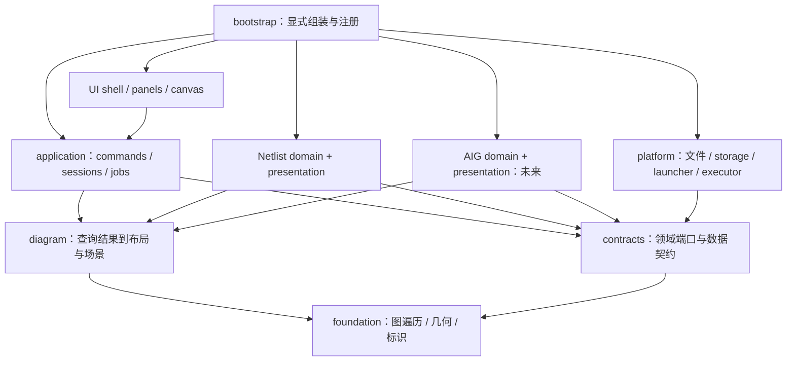

# 面向 Netlist 与 AIG 的可扩展工作台架构

日期：2026-09-09；2026-09-11 全量审计。设计基线：`8d53bfc`。状态：阶段 7 架构基线已实现。

本文定义后续架构与迁移约束；当前实现说明见 [ARCHITECTURE.md](ARCHITECTURE.md)，实施记录与验证证据见 [阶段 7](STAGE_7_PLAN.md)。文中的核心目录、接口和契约已经落地；示意类型不保证与 JavaScript 导出逐字一致。

## 1. 结论与目标

采用**模块化单体、独立领域模型、共享图形工作台**。继续使用离线静态资源、原生 JavaScript ES modules 和 vendored ELK；接口先用 JSDoc 和契约测试落实，不要求迁移框架、引入打包器或联网插件系统。

Netlist schematic 与未来 AIG 是两个领域功能。它们分别拥有输入解析、语义模型、对象索引、领域分析、显示投影与符号定义；共同使用工作区、搜索交互、Focused 操作、任务调度、基础图算法、几何布局、SVG 场景提交、画布手势与导出基础设施。

衡量成功的方式是“新增功能要改哪些边界”：增加一种图类型应主要新增一个领域包及注册项；增加一项领域分析应主要扩展该领域；调整缩放行为应只改公共画布。不能把遍布各层的 `if (kind === 'aig')` 作为接入方式。

阶段 7 已建立并验证这些边界。生产级 AIG 导入和浏览属于后续功能交付；本阶段使用最小内存 AIG 样例验证扩展性，避免为未明确的输入格式实现完整产品。

当前产品仍有三类明确的过渡层：`main.js` 负责浏览器组装及少量旧状态 hydration，Single/Compare view-session bridge 向旧 DOM/存档字段投影，`workspaceRequest.js` 仍是产品中的异步失效保护。`JobCoordinator`、`ArtifactStore` 和 `ComparisonCoordinator` 已有契约与测试，但尚未替换所有产品编排；旧 Netlist graph/layout 实现也仍由领域 facade 适配。它们不是第二套业务规则，新功能不得绕过 commands、pipeline 或 Scene 边界。移除条件见阶段 7 审计记录。

## 2. 当前拖累来自哪里

| 当前证据 | 影响 | 目标边界 |
| --- | --- | --- |
| `src/app/main.js` 仍编排输入、搜索目标、roots、Compare、布局、手势和存档 | 每次功能变化需要理解全局状态与多个回调链 | application 用例 + 独立 UI 控制器，入口只组装依赖 |
| `appState.js` 将 Single 和左右 Compare 状态平行维护 | 新状态需要复制 reset/save/restore/sync 逻辑 | 每个画布一个 ViewSession；Compare 只协调两份 session |
| `workspaceRequest.js` 捕获整份应用的当前 module 和 Compare 字段 | 目前可保护旧结果，但多文档、多画布时取消范围不清楚 | 按 document/session/job 分域的 revision 与提交令牌 |
| `nodeGeometry.js` 读取 `node.ref.pins` 并调用 inference | 布局无法直接处理没有 cell/pin 的另一种图 | 领域展示适配器给出完整尺寸、端口与连接点 |
| `svgRenderer.js` 引用 gate inference、nodeGeometry，内部判断 gate kind | 新领域渲染会牵动已有门级语义 | 领域符号投影 + 公共 Scene renderer |
| `layoutGolden.js` 导入 `app/focusedViewPolicy.js` | 底层数据格式反向依赖应用状态 | Golden codec 在存档边界组合视图状态和几何快照 |
| `moduleWorkspace.js` / `compareWorkspace.js` 已共享 graph/layout helpers，但编排参数仍重复 | 共享算法不足以保证相同状态操作的行为一致 | 一条 View pipeline，Compare 复用两次 |

已有 parser、IR、routing contract、空间索引、viewport、pointerSession、progressive renderer 等模块有实际价值，按职责迁入或包在适配层后逐步替换。文件拆小本身不构成架构完成。

## 3. 模块与依赖方向



图中箭头表示静态依赖。application 通过注入的领域接口调用领域实例，不 import 某个具体领域实现；bootstrap 是唯一同时知道所有具体实现的地方。

| 模块 | 拥有的职责 | 不得依赖 |
| --- | --- | --- |
| `foundation/` | 无业务含义的标识编码、图遍历、几何谓词、空间索引 | application、domains、DOM、storage |
| `contracts/` | ObjectRef、查询/诊断结果、领域和执行器接口 | 具体领域、UI、平台实现 |
| `domains/netlist/` | 原 Netlist IR、推断、alias/timing/结构分析、schematic 投影与符号 | AIG 实现、全局 app state、浏览器存储 |
| `domains/aig/` | AIG IR、literal/时序边界语义、分析和投影 | Netlist 实现、全局 app state、浏览器存储 |
| `diagram/` | 中性显示图、测量后的图、布局/布线契约、Scene、几何校验 | cell inference、原文 parser、application、DOM |
| `application/` | 文档、ViewSession、命令、任务提交、历史、Compare 协调、存档用例 | UI DOM、具体领域和具体 storage/executor |
| `ui/` | 菜单、面板、搜索控件、canvas controller、SVG DOM 提交 | 原文解析、领域 IR 内部字段 |
| `platform/` | 文件/字节读取、sessionStorage、下载、loopback manifest、执行器适配 | UI 控件、私有领域算法 |
| `bootstrap/` | 静态注册领域、provider、能力贡献和平台适配器 | 无向上依赖；业务规则不得堆在这里 |

不引入通用服务定位器或随意订阅的全局事件总线。修改状态走命名 command；只读变化通过限定范围的订阅传给 UI；日志和 progress 是结果通知，不承担业务控制流。

建议目标目录（按迁移批次创建，初期可保留旧路径 re-export）：

```text
src/
  bootstrap/                 create_application.js、注册具体实现
  contracts/                 document、object_ref、domain、job、diagnostic
  foundation/                graph、geometry、identity
  application/               documents、sessions、commands、jobs、comparison、persistence
  domains/
    netlist/                 model、importers、analysis、presentation、feature.js
    aig/                     后续功能；阶段 7 的样例先放 tests/support/
  diagram/                   model、layout、routing、scene、validation
  ui/                        shell、panels、canvas、svg
  platform/                  browser_io、storage、executor、startup
```

新文件用 snake_case；已有 camelCase 路径只在职责迁移时连同 imports 一起调整，保留外部入口兼容。公共能力只有在 Netlist 和第二个样例都能消费时才提升到 foundation/diagram，避免形成新的杂项目录。

## 4. 四种数据，四个明确边界

### 4.1 Document 与领域 IR：源数据

Document envelope 包含 `documentId`、`domainId`、`sourceRevision`、输入摘要、诊断和领域 model handle。源文件通过 text 或 bytes 进入 importer；平台不能强制所有格式经过字符串解码，以便未来读取二进制 AIGER。

Netlist IR 继续描述 module、cell、pin、net、assign；AIG IR 单独描述节点、literal、输入/输出和状态元素。不能把 AIG AND 假装成一个标准单元，也不能把 Netlist 无损塞进仅有 nodes/edges 的通用源模型。

model handle 指向只读领域对象；应用不枚举其内部字段。查询/分析由领域服务完成。Reload 成功后才替换已提交的 Document；解析失败保留上一份有效源数据。

### 4.2 ObjectRef 与投影映射：身份

统一引用结构示意：

```text
ObjectRef = { documentId, unitId, kind, localId, terminalId? }
```

- Netlist unit 通常是 module；AIG unit 通常是单个 network。
- `localId` 使用 canonical instance/net 名或 AIG 节点 ID，display name 单独保存；不能解析 UI label 来恢复身份。
- sourceRevision 属于有效性上下文，不混入稳定对象身份；source reload 后必须由领域确认引用仍有效，否则清理或标记失效。
- 图元 ID 是 view 内显示身份：boundary、hub、同一 latch 的 Q/D 投影可能一对多。`projectionMap` 明确记录图元到源对象/关系的对应；点击边界图元时能回到完整图中的目标。
- 跨 Netlist/AIG 的映射需显式 provenance（转换产物或外部映射表），不按同名或数字碰巧相同自动建立对应。

### 4.3 Diagram 与 LayoutGraph：显示和几何

领域先返回可见对象及关系，再由自己的 presentation 转为 Diagram。Diagram 只包含展示所需数据：稳定显示 ID、ObjectRef 映射、节点样式键、文字、端口、边端点、关系归属、端点装饰和可选 bundling 信息。

布局入口接收 **MeasuredGraph**：每个节点已有 width/height、完整 ports（端口 ID、局部坐标、side、外法线、连接点）、避障边界和装饰留白。布局不再读取 `ref.pins`、猜 gate kind 或推断方向。输入/输出 bubble 占用的空间在测量时明确给出。

provider 输出 LayoutGraph：节点位置、逐关系路径、可选共享路径及 ownership、标签锚点、bounds、provider/profile 版本。自动结果不可突变；位置/尺寸 override 单独应用，生成 adjusted graph。

`routeGroup` 只有在领域确认关系可以共用物理路径时才提供。generic engine 不根据 net 名或 label 自行合并边；每条逻辑关系始终有独立 ID，平行边和重复 fanin 必须可追踪。

### 4.4 Scene 与 RenderSession：绘制

Scene 是绘图指令/惰性迭代计划：paths、shapes、text、decorations、hit targets、layers 和 bounds，不携带原始 IR。领域 presentation 提供符号几何；公共 renderer 负责安全序列化、SVG DOM、分批提交、命中映射和导出。

反相 bubble 是可见且可命中的端点装饰，其绘制依据来自投影，renderer 不再调用 inference。网表输入、标签等字符串经过共享 escape 边界，不能作为 HTML、事件代码或任意资源 URL 插入。

Scene 不要求预先生成整图 SVG/primitive 数组；保留惰性批次生产能力。每个 mount 有独立 RenderSession；新场景、小图、空态、关闭视图都会取消旧批次。导出读取同一已提交场景，可 eager 序列化，不读取半完成 DOM。

## 5. 最小领域接口与能力贡献

领域以静态模块注册。下面是职责契约，具体参数用小型记录与 JSDoc 定义，不是要求所有方法成为单个巨型对象：

| 接口 | 输入 → 输出 | 所属行为 |
| --- | --- | --- |
| `importSource` | SourceInput + context → ModelResult | 格式校验、IR、诊断；无 DOM 和状态提交 |
| `listUnits` / `resolveObject` | model + ref → unit/object descriptor | 稳定引用校验和显示摘要 |
| `search` | model + query + limit → SearchHit[] | 返回 ObjectRef；评分/领域索引在领域内 |
| `queryView` | model + ViewQuery → VisibleGraph + projectionMap | whole/focused、cut boundary、时序边界策略 |
| `describeSelection` | model + ObjectRef → DetailSections | 结构化面板数据和可执行 action ID |
| `projectDiagram` | VisibleGraph + presentation policy → Diagram/MeasuredGraph | 符号、端口、边语义与显示投影 |
| 可选 `analyze` / `matchObjects` | 领域定义的请求 → AnalysisResult / MatchResult | 时序、比较、统计等可选能力 |

`feature.js` 贡献 domainId、版本、支持的输入格式、可用 view/analysis/export、布局 profile、panel/command 描述。注册器检查 ID 冲突与必需接口，application 按 capability 决定操作是否可用；不让每个 command 自己判断文件类型。

功能面板的字段、验证和命令 payload 由所属功能定义。普通 UI 以 descriptor 渲染；特殊控件可由仓库内可信模块提供 view factory，但只得到限定 command/query API 和容器，不得到整个 mutable store。

新增功能的落点：

| 后续需求 | 主要改动 |
| --- | --- |
| AIG 浏览 | AIG importer/model/query/presentation + 一个 feature 注册项 |
| Liberty | Netlist 的数据附件与 inference 服务；不改通用 canvas |
| 时序路径高亮 | Netlist analysis 返回 ObjectRef 集合，公共 overlay 展示 |
| 新布局算法 | 新 provider + 支持的 measured graph/profile 声明 |
| Canvas renderer | Scene consumer 与命中适配；不重新解析领域模型 |
| 新工具栏命令 | 所属 application/domain 用例 + command contribution |

## 6. 状态和 command：功能增长的主要承载点

### 6.1 状态归属

| 状态 | Owner | 隔离与保存规则 |
| --- | --- | --- |
| 输入与 IR、sourceRevision | DocumentStore | 按 document 管理；源数据只读 |
| Cell Config、timing 附件和各自 revision | Netlist document services | 用明确作用域共享，不扩散到 AIG |
| unit、view query、roots、selection、策略、overrides、导航历史 | ViewSession | 每个画布独立；通过 commands 修改 |
| 两侧 sessionId、匹配规则、同步开关 | ComparisonSession | 不再复制两份图构建逻辑 |
| viewport、面板开关等视图设置 | ViewSession / shell settings | viewport 与计算结果分开更新 |
| pointer capture、drag preview、RAF、DOM mount | CanvasController / RenderSession | 瞬态，不写存档 |
| 运行中任务、取消句柄、产物缓存 | JobCoordinator / ArtifactStore | 不作为可持久化业务状态 |

store 可用普通对象、Map 和少量 subscribe 实现，不强制 Redux。唯一写入口为 command handler/reducer；组件不能直接修改根对象，测试通过注入 store/executor 验证行为。

### 6.2 命令及 effect

命令示例：`document.open`、`view.selectUnit`、`focus.add`、`focus.set`、`focus.remove`、`focus.activate`、`selection.reveal`、`layout.setPolicy`、`layout.commitOverrides`、`comparison.setSync`。

每条命令显式带 target sessionId 和 ObjectRef/payload。处理分为：校验 capability/引用 → 纯状态决策 → 提交小状态变更 → 执行所需 effect。决策结果指出需不需要 query/layout/render/viewport/persist，禁止每个 UI handler 自行全量重建。

Focused roots 与 selection 独立。搜索不可见对象使用 `selection.reveal`，按领域和当前模式决定追加 roots；显式 Set 才替换。roots 上限在所属 query policy 边界定义；达到上限返回可识别 rejection，已有 roots 不被排序截断挤走。已绘制对象的选择/居中不调用 provider。

drag move 只更新 preview，每帧最多一次；结束时发一个 commitOverrides。未来 undo 可围绕可序列化 command 建立，但本阶段不实现事件溯源或无限操作历史。

### 6.3 Compare 由两个普通 ViewSession 组成

Single 是一个 ViewSession；Compare 是两个 ViewSession 加 coordinator。pan/zoom 同步、roots 同步、对象选择同步是三个独立策略。

匹配由领域提供，结果为 matched/unmatched/ambiguous，不把名称相同当作等价证明。找不到另一侧目标时保留该侧有效状态并反馈。异构 Netlist/AIG 可并排浏览，但只有提供明确 provenance/matcher 时才允许对象同步。

一项同步操作带 transactionId 和 originSessionId，原子提交两侧意图状态并阻止回声循环；若产品选择成对呈现比较结果，等待双方相同 transaction 的产物后一起切换。单侧操作只取消该侧任务，不使另一侧计算失效。

## 7. 统一流水线、任务和缓存

```text
SourceInput -> importer -> committed Document
Document + ViewQuery -> VisibleGraph -> domain presentation -> MeasuredGraph
MeasuredGraph + LayoutPolicy -> auto LayoutGraph
auto LayoutGraph + Overrides -> adjusted LayoutGraph
adjusted LayoutGraph + display overlays -> Scene -> RenderSession
```

application 为阶段选择服务并安排执行；领域和几何算法保持无 DOM、无全局状态。现有 moduleWorkspace/compareWorkspace 先适配到这条流水线，不重写成熟算法。

JobContext 至少包括 `{documentId, sourceRevision, sessionId, sessionRevision, jobId, signal, reportProgress}`。artifact 记录依赖 revision、schema/profile/provider 版本和生成请求身份。

- 新导入有 document-open generation，旧解析成功不能覆盖更晚的打开操作。
- source/config/timing 改变按依赖失效；view query/layout 改变推进对应计算 revision；纯 viewport 变化不取消正确的布局结果。
- 所有 success/error/progress/render completion 必须通过同一个 current-token 检查；旧任务错误不覆盖新视图状态。
- selection reveal 另带 selectionRevision，防止等待布局时用户另选对象后又被旧定位抢走。
- `AbortSignal` 是合作取消；同步 Simple layout 首阶段仍只能阻止提交。Worker/分段算法实现真正取消时使用同一 Executor 契约。
- 替换产物后释放旧 artifact、索引和 RenderSession 引用；关闭 document/session 取消订阅与任务，缓存设容量限制。

失效矩阵（先落实复用边界，是否增加缓存按测量决定）：

| 变化 | 最早重算阶段 |
| --- | --- |
| 原始源文件 | parse/import |
| Cell Config / pin override | Netlist semantic graph/inference |
| roots、深度、alias/collapse | 对应 query/投影阶段；完整索引可复用 |
| spacing/provider | measurement 或 layout，取决于该策略是否改变节点尺寸 |
| timing snapshot/metrics | annotation/presentation；若 badge 尺寸影响避障则重测量，否则 overlay |
| 节点位置/尺寸 override | 从 auto graph 派生 adjusted graph；不重跑 provider |
| selection、hover、pan/zoom | overlay/transform；不 parse/query/layout |

缓存 key 必须包含真正影响产物的依赖，不能只按 module 名缓存。保留阶段耗时、候选计数与取消数作为诊断；性能优化和架构迁移使用独立提交与可比较基线。

## 8. 布局、路由与渲染如何复用

公共几何内核拥有正交性、端点法线、避障、segment index、路径简化和 bounded search。Netlist 的多扇出共享线树、pin label、cell locality 等策略保留在 `netlist-schematic` profile；不强迫所有图采用相同空间偏好。

初期将现有 Simple/ELK 包成 Netlist legacy provider adapter，明确其输入仍是旧 schematic graph。随后先提取测量/ports，再把 provider 改为消费 MeasuredGraph。适配层只向内转换一次，禁止新契约与旧 graph 在每个阶段反复复制转换。

AIG 初期可使用相同 layered 几何骨架和自己的 profile；不要求立即复用现有 net-tree router。provider 必须声明支持的 profile 与端点能力，不支持时选择匹配的 fallback 并报告，不静默丢弃 polarity、ports 或 edge ownership。

通用 validator 检查几何；领域 validator 检查语义与投影保真；profile quality 检查可读性。16px 可见转角是软偏好，不能为满足该偏好绕过 pin-side 或节点避障。纯架构提取保持原数值和现有输出，策略调优单独验证。

## 9. AIG 接入设计与边界

### 9.1 语义模型

AIGER 的基本图由输入、二输入 AND、带极性的 literal 和输出组成，并可包含 latch；literal 的变量索引与最低位极性分离，0/1 表示常量。ASCII 与 binary 编码不同，但应解码到同一领域模型。[AIGER 格式定义](https://fmv.jku.at/aiger/FORMAT)

建议内部结构（本项目设计，并非 AIGER 文件格式）：

```text
AigModel
  nodes: input | and(fanins[2]) | latch(next, initial)
  outputs: [{id, literal, symbol?}]
  symbols, properties, diagnostics, sourceMap
Literal = {nodeId, inverted}       // 常量可使用保留的 const0 节点
```

AND fanin 保留两个槽位；即使两个槽引用同一 literal，也不合并逻辑关系。edge ID 从 consumer 与 fanin slot 产生，节点重排不得改变身份。内部节点无名字时显示稳定 ID，不能要求存在 cell type 或 module hierarchy。

AIGER 1.9 增加非零/未初始化 latch 和性质、约束等内容。相应信息需被解析和保留；未实现的非零 section 要明确拒绝或提示不支持，不能静默当成普通输出而宣称完整兼容。[AIGER 1.9 说明](https://fmv.jku.at/hwmcc11/beyond1.pdf)

### 9.2 绘图与局部浏览

- 正反相在每条消费关系上保留，反相标记默认绘在消费端，输出 literal 的反相也必须可见。不能通过共享 trunk 丢失某个分支的极性。
- 初版 AIG profile 不做物理共享线合并；以后若启用 bundling，必须证明 branch polarity、hit target 与 fanin slot 都保留。相同 source 不代表两条关系可直接折叠。
- 组合 cone 对 AND dependency 遍历；默认在 latch 边界停止。可将一个 latch 投影成当前状态源 Q 和 next-state 接收端 D，两者指回同一语义对象的不同角色；时序连接不参与组合拓扑排序。
- 不把整个带反馈的 sequential network 当 DAG 排序。跨周期展开需要显式 temporal depth 和预算，是后续独立分析能力。
- 常量、重复 fanin、正反相扇出、共享子图和无 symbol 情况都必须能搜索、选择、追 cone、显示 cut boundary 和导出。

### 9.3 输入路线与 Netlist 互操作

优先支持外部生成的 AIG 数据，建议生产功能从 ASCII `.aag` 开始，再接二进制 `.aig`。实际首版格式在开始 AIG 功能时确认，架构现在同时支持 text/bytes。

Netlist → AIG 是单独的语义转换服务，不属于 parser 或 renderer。未知 blackbox、只有 gate kind 而无准确函数的 cell、多输出/时序语义必须有明确转换规则或拒绝结果；不能用无 `.lib` 启发式图形类型证明布尔函数。转换生成新 Document，并提供 many-to-many provenance。原 Netlist IR 不被转换或结构 hashing 原地改写。

阶段 7 的扩展性验收只需测试用内存 AIG 模型：二输入 AND、一个反相输入、常量输出、共享扇出和 latch Q/D 边界。此样例经过相同 session/command/layout/scene 路径，公共模块不得访问 Netlist 字段。正式 parser、完整 AIGER 兼容、转换与逻辑等价不纳入阶段 7 完成条件。

## 10. 存档、启动与离线发布

Session、Golden、Cell Config、startup manifest 保持各自格式与版本，不能用一个巨型 JSON 代替。

- application 的 persistence 用例组合 document identity、ViewSession snapshot 和领域配置；platform adapter 负责读写。源文本仍按现有隐私范围保存在 sessionStorage，不扩展为默认长期存储。
- 旧 session v1、单 root 字段、Golden v1/v2 由单向 migration codec 转为新运行时状态；按实际已有 reader 固定兼容 fixture。旧 layout key/node ID 经 Netlist adapter 映射，不重新解释 label。
- 新存档显式带 domainId、unitId、schemaVersion、source fingerprint、profile/provider 版本。错误文档或不兼容 source 的 overrides 不自动套用；记录失效引用并允许保留原文件。
- Golden 只保存明确要求的几何与视图状态，几何 serializer 不 import application；artifact/session 组合在 persistence 层完成。
- startup v1 继续映射到 Netlist commands；未来新版本可带 domain/bytes 输入。Node/Python/Windows launcher 共享协议 fixture，不在服务端复制领域业务算法。
- 注册表只加载随包提供的模块；新增目录必须被离线打包覆盖。图形后端、vendored ELK 及许可证、相对资源路径均有 Windows 包 smoke check。

## 11. 迁移方法、约束和架构验收

先定义契约并用 legacy Netlist adapter 跑通现有功能，再将底层纯能力逐个迁出。过渡期旧 API 可以 re-export，新功能只进入新边界；每批记录 adapter 列表及移除条件，避免永久维护两套业务实现。

允许 UI/存档使用兼容 adapter；禁止新公共层反向 import legacy app/infer。增加静态 import 边界检查，旧例外以精确文件列表记录，每个例外要有迁移批次，不能通配放行整个目录。

阶段 7 的结构验收：

1. Single/Compare 复用 ViewSession 与 pipeline，新图类型无需复制 application 主流程。
2. application、通用 diagram、Scene renderer 不读取 `ref.pins`、`gateKind`、module/cell 私有字段。
3. 所有状态写入和异步可见提交有单一归属；旧任务不能通过 error/progress/render 绕开失效检查。
4. 内存 AIG 样例可经共同工作台完成搜索、Focused、布局、选择和导出，证明适配器边界。
5. 旧输入、session、Golden、startup、手动调整与离线发布保持兼容；未完成或失败的验证如实保留。

正确性验证与性能门禁见阶段 7。历史 `dp_020`/`sop_004` 超时不应冻结纯应用模块迁移；涉及布局输出/复杂度的批次必须先取得同环境对照证据，不以放宽阈值或缩减案例数掩盖回归。

## 12. 关键取舍

| 决策 | 原因与代价 |
| --- | --- |
| 独立领域 IR，共享显示/几何契约 | 保存两种电路语义；需要维护投影与源映射 |
| 每画布一个 session，Compare 做协调 | 消除平行全局状态；需要明确定义同步事务和取消域 |
| 静态领域注册 + 小接口 | 可测试、可离线；不提供第三方动态插件沙箱 |
| 普通 JS + JSDoc + 契约测试 | 兼容当前运行方式；类型约束需由测试和边界校验补足 |
| 先适配旧算法，再抽取公共几何 | 每批可回退；短期会有带移除期限的 legacy adapter |
| Worker/缓存按证据实施 | 不把并发和失效复杂度提前引入；接口预留不代表性能已改善 |

本文的 AIG 语义依据来自上文两份官方格式资料；工作区、模块划分、接口与迁移路线是根据本仓库现状提出的架构决策。
